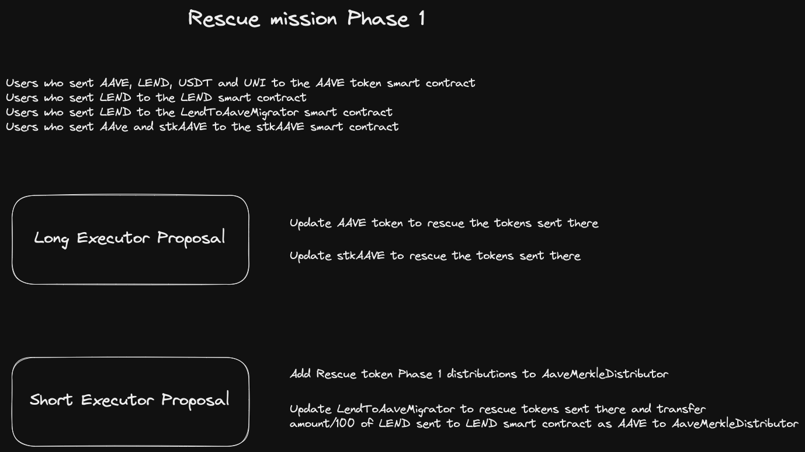

# Aave rescue mission. Phase 1 :ambulance: :ghost:
<p align="center">
  
</p>
Repository containing all the code needed for the initial phase to rescue tokens sent directly to contracts of the Aave ecosystem.

This initial phase will affect the following:

- Users who sent [AAVE](https://etherscan.io/token/0x7fc66500c84a76ad7e9c93437bfc5ac33e2ddae9), [LEND](https://etherscan.io/token/0x80fB784B7eD66730e8b1DBd9820aFD29931aab03), [USDT](https://etherscan.io/token/0xdac17f958d2ee523a2206206994597c13d831ec7) and [UNI](https://etherscan.io/token/0x1f9840a85d5af5bf1d1762f925bdaddc4201f984) to the [AAVE](https://etherscan.io/token/0x7fc66500c84a76ad7e9c93437bfc5ac33e2ddae9) token smart contract
- Users who sent [LEND](https://etherscan.io/token/0x80fB784B7eD66730e8b1DBd9820aFD29931aab03) to the [LEND](https://etherscan.io/token/0x80fB784B7eD66730e8b1DBd9820aFD29931aab03) smart contract
- User who sent [LEND](https://etherscan.io/token/0x80fB784B7eD66730e8b1DBd9820aFD29931aab03) to the [LendToAaveMigrator](https://etherscan.io/address/0x317625234562B1526Ea2FaC4030Ea499C5291de4) smart contract
- Users who sent [AAVE](https://etherscan.io/token/0x7fc66500c84a76ad7e9c93437bfc5ac33e2ddae9) and [stkAAVE](https://etherscan.io/token/0x4da27a545c0c5b758a6ba100e3a049001de870f5) to the [stkAAVE](https://etherscan.io/token/0x4da27a545c0c5b758a6ba100e3a049001de870f5) contract

The LEND sent to the specified contracts will be claimed already as AAVE tokens with the transformation LEND to AAVE already taken into account (1 AAVE = 100 LEND)


## About

This repository is divided in two parts:

- [merkle trees](#merkle-trees): these are the trees that contain the pairs address:value needed for users to claim the rescued tokens.
- [contracts](#contracts): these contain the updated implementations of the different smart contracts to be upgraded to include the release of locked funds, the distributor contract where users will be able to claim the tokens and the payload contracts necessary to execute the rescue.

## Install

To install and execute the project locally, you need:

- ```npm install``` : As the merkle trees are generated via Nodejs scripts, you need to install all dependencies necessary.
- ```forge install``` : This project is made using [Foundry](https://book.getfoundry.sh/) so to run it you will need to install it, and then install its dependencies.

To run the scripts to generate the Merkle trees:
```
npm run generate-json // generates json with address - amounts - txs
npm run generate-tree // generates MerkleTree jsons for every resque token
```

## Merkle Trees

For wallets to be able to claim the tokens they sent to the contracts specified on Phase 1, we have created a different MerkleTree for every claimable token (AAVE, stkAAVE, UNI, USDT).
You can find the merkle tree generator script here: [MerkleTree Generator](js-scripts/generate-address-value-maps.ts)

On the [maps](js-scripts/maps) folder you will find the JSON files containing:

- ...RescueMap.json : list of address:value(in WEI) that will be used to create the rescue merkle tree for the specified token.
- ...RescueMerkleTree.json : list indicating for every address able to claim the rescued tokens, the amount, the index, and the merkle proof, needed for claiming the specified token.

This folder also contains a [resume](js-scripts/maps/amountsByContract.txt) indicating the amount to rescue for every token sent on the contracts specified on phase 1.

### Merkle Trees calculations

- AAVE merkle tree => [map](/js-scripts/maps/aaveRescueMap.json) | [tree](/js-scripts/maps/aaveRescueMerkleTree.json): The Aave merkle tree is formed by:
  - The AAVE tokens sent to the AAVE contract, the LEND sent to LEND contract, LEND to AAVE contract, AAVE sent to stkAAVE contract. These are accounted by getting all transfers of these tokens to these contracts.
  - The LEND sent to the LendToAaveMigrator contract. In this case when we get the transfers of LEND to the contract, we need to remove the transfers that where done as part of calling the migration method. We do this by ruling out the transfer transactions that have the LendMigrated event topic on the tx receipt, as this event would be emitted on the same transaction.
  - The AAVE sent to the stkAAVE contract. In this case we need to rule out the transfers of AAVE that are done when staking. For this we remove the transfer transactions that have the event Staked topic on the tx receipt, as this event is emitted when staking.
- UNI merkle tree => [map](/js-scripts/maps/uniRescueMap.json) | [tree](/js-scripts/maps/uniRescueMerkleTree.json): This tree is formed by getting the transfer transactions of UNI to the AAVE contract.
- USDT => [map](/js-scripts/maps/usdtRescueMap.json) | [tree](/js-scripts/maps/usdtRescueMerkleTree.json): This tree is formed by getting the transfer transactions of USDT to the AAVE contract.
- stkAAVE => [map](/js-scripts/maps/stkAaveRescueMap.json) | [tree](/js-scripts/maps/stkAaveRescueMerkleTree.json): This tree is formed by getting the transfer transactions of stkAAVE to the stkAAVE contract.

## Contracts

On the [contracts](/src/contracts) folder we can find the necessary solidity smart contracts to rescue the tokens specified on phase 1.

- Contract Implementation Updates:
The following contracts are updates on the current deployed implementations, to add the necessary logic for the rescue. For the case of implementation updates, code differentials have been generated by pulling the currently deployed source code from [etherscan](https://etherscan.io/).
  - [AaveTokenV2](/src/contracts/AaveTokenV2.sol): The new implementation (REVISION 3) adds the rescue logic on the initialize method. This is so the rescue gets executed when the new implementation gets deployed. To be able to rescue the tokens sent to the AAVE contract, we need to send the arrays of tokens and amounts, that correspond to the pairs token:amount to rescue. We also need the address of the distributor where the tokens will be sent. Once a token has been rescued an event will get emitted for off-chain accountability.
  The code differential between the new implementation and the current deployed one can be found [here](/diffs/AaveTokenV2-diff.md).
  - [StakedTokenV2Rev4](/src/contracts/StakedTokenV2Rev4.sol): The new implementation (REVISION 4) adds the rescue logic on the initialize method. This is so the rescue gets executed when the new implementation gets deployed. To be able to rescue the AAVE and stkAAVE sent to the stkAAVE contract, we need to send the arrays of tokens and amounts, that correspond to the pairs token:amount to rescue. We also need the address of the distributor where the tokens will be sent. Once a token has been rescued an event will get emitted for off-chain accountability. In this case the name of the contract has also been updated to Rev4 from Rev3.
  The code differential between the new implementation and the current deployed one can be found [here](/diffs/StakedTokenV2Rev4-diff.md).
  - [LendToAaveMigrator](/src/contracts//LendToAaveMigrator.sol): The new implementation (REVISION 2) adds the rescue logic on the initialize method. This is so the rescue gets executed when the new implementation gets deployed. To be able to rescue the LEND sent to the LendToAaveMigrator contract, we need to send the address of the distributor where the tokens will be sent, and the amount of LEND. The initializer when executed will migrate the amount passed, and send the corresponding AAVE tokens to the distributor. Then it will send the LEND balance of the contract to the LEND contract as to take it out of circulation. This new revision of the implementation also adds this transfer of LEND to LEND contract to the migrator method, as to also take out of circulation the future LEND migrated. Once the LEND has been rescued an event will get emitted for off-chain accountability.
  The code differential between the new implementation and the current deployed one can be found [here](/diffs/LendToAaveMigrator-diff.md).

- [AaveMerkleDistributor](/src/contracts/AaveMerkleDistributor.sol): This contract has the logic for the users to be able to claim the rescued tokens, according to the generated merkle trees. To enable a rescue of a determined token, the addDistributions method needs to be called with the arrays of tokens and merkleRoots, indication the pairs token:merkleRoot (indicated in the token specific merkle tree rescue json [files](#merkle-trees)). Once a distribution is added. A user can claim the tokens by passing the index, account and amount also indicated [here](#merkle-trees).

### Governance Payloads

For the token rescue to be executed, there has been a need to create two Proposal payloads. One to be executed by the Aave Governance [short executor](https://etherscan.io/address/0xEE56e2B3D491590B5b31738cC34d5232F378a8D5), and the other one for the [long executor](https://etherscan.io/address/0x61910EcD7e8e942136CE7Fe7943f956cea1CC2f7)


- [ProposalPayloadShort](/src/contracts/ProposalPayloadShort.sol): This proposal payload will deploy the AaveMerkleDistributor contract and add the AAVE, USDT, UNI and stkAAVE distributions. It will also deploy the new implementation of the LendToAaveMigrator. The LendToAaveMigrator will be initialized with the deployed AaveMerkleDistributor and with the LEND amount calculated by adding:
  - LEND amount sent to LendToAaveMigrator: 8007719287288096435418 LEND in WEI.
  - LEND amount sent to LEND contract: 841600717506653731350931 LEND in WEI. This amount will directly be accounted by rescuing AAVE, as the LEND contract will not be updated, but as the LendToAaveMigrator has all remaining AAVE, we can assume that it was sent there, and so it can be migrated with the rest of the LEND amount sent.
- [ProposalPayloadLong](/src/contracts/ProposalPayloadLong.sol): This proposal payload will deploy and initialize the new implementations for the AAVE token and the stkAAVE token with appropriate amounts:
  - AaveTokenV2: from this new implementations the following tokens will be rescued:
    - LEND: 19845132947543342156792 LEND in WEI
    - AAVE: 28420317154904044370842 AAVE in WEI.
    - UNI: 110947986090000000000 UNI in WEI.
    - USDT: 15631946764 USDT in WEI.
  - StakedTokenV2Rev4: from this new implementation the following tokens will be rescued:
    - AAVE: 768271398516378775101 AAVE in WEI.
    - stkAAVE: 107412975567454603565 stkAAVE in WEI.

## Security

Audit report by Certora can be found [here](./certora) 
Storage layouts diffs have also been generated for the contracts where the implementation is updated:
- Aave Token storage layout [Diff](./diffs/AaveTokenV2_layout_diff.md)
- StkAave Token storage layout [Diff](./diffs/StakedTokenV2Rev3_layout_diff.md)
- LendToAaveMigrator storage layout [Diff](./diffs/rescue_LendToAaveMigrator_layout_diff.md)
[Tests](./test) have also been added checking end to end executions


## Tests

We have used foundry to create this solidity project, so to run the tests you will need to run ```forge test```. But as we are using already deployed contracts, the tests need to be run in a fork environment. For this you will need to execute this command:

```
➜ forge test
```

To test deployment you can run ```npm run deploy:test``` which will give out possible deployed addresses and will output gas estimation. For this you will need to add these on your .env file:
```
PRIVATE_KEY= // used to deploy contracts
FORK_URL= // rpc url pointing to mainnet
```


### Deploy

To deploy the necessary contracts and proposal payloads, a [deploy.sol](/scripts/Deploy.s.sol) solidity forge script has been created. There we make use of the [deployCode](https://book.getfoundry.sh/reference/forge-std/deployCode.html?highlight=deploycode#deploycode) forge std method to deploy the contracts that have the solidity version 0.7.5 (mainly the AaveTokenV2, StakedTokenV2Rev4 and ProposalPayloadLong) that are incompatible with the 0.8.0 version used everywhere else.

You can use the npm script:
```
npm run deploy
```
Which will deploy everything needed for the rescue phase 1 and will try to verify with etherscan. For this remember to add:
```
ETHERSCAN_API_KEY= // used to verify contracts against etherscan
PRIVATE_KEY= // used to deploy contracts
FORK_URL= // rpc url pointing to mainnet
```
to your .env file. If you want to deploy to a test network you only need to change ```FORK_URL``` to the rpc pointing to that network.

## Mentions

In this project we based the AaveMerkleDistributor contract, and the merkleTree generation on Uniswap's [merkle-distributor](https://github.com/Uniswap/merkle-distributor) project. Differences explained [here](./MerkleDistributionDiff.md).


## License
Copyright © 2023, [BGD Labs](https://bgdlabs.com/). Released under the [MIT License](./LICENSE).
